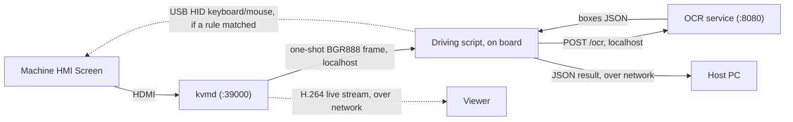

# OCR Pipeline (RK3588 / RECC)

The RECC board reads a machine's HMI screen over HDMI. This allows the machine to be monitored, and operated when a rule matches, with no person at the controls. **System Architecture** below describes the full flow, including the parts that live outside this repo.

This repo holds the production C++ implementation: PP-OCRv6 tiny detection and recognition on the Rockchip RK3588 NPU via RKNN. Input is raw BGR888 only, because uncompressed pixel data preserves small text better.

| Component | Model | Format | Notes |
|-----------|-------|--------|-------|
| Det | PP-OCRv6 tiny det | INT8, 480×480 | ImageNet norm baked in; raw BGR in |
| Rec | PP-OCRv6 tiny rec | FP16, 320×48 | `[0,1]` normalisation |

Detection runs a full-image pass at the detector's fixed 480x480 input, then a grid of overlapping tiles closer to native resolution, merging both and dropping duplicates by NMS so small text survives the full-frame resize.

### Why There Is No Preprocessing

Preprocessing was tested on both stages and dropped. Binarization and upscaling made detection worse, so detection runs on unprocessed input. CLAHE contrast enhancement and unsharp-mask sharpening, applied to each crop before resizing, hurt recognition accuracy on every test screen: the 82.5% baseline fell to 59.6% with CLAHE and 77.4% with sharpening. Recognition therefore also runs on unprocessed crops.

Those figures come from the `board_deploy/testdata/*.bgr888` screens, which are screenshots of machine displays supplied for testing rather than frames captured through `kvmd` over HDMI. They are the right input for comparing options against each other, since every option sees identical pixels, but the absolute numbers are not production-path figures: a real HDMI capture goes through the machine's video output and the board's HDMI receiver first. Nothing has yet been measured on a real HDMI capture of a real machine.

## System Architecture

Nothing in this repo drives the machine. `kvmd` captures the screen, the OCR pipeline turns pixels into text, and `pipeline/automation/` decides whether a rule matched. Acting on that decision, by sending keyboard and mouse input back over USB HID, is the job of `recc_gen5_test_kit/automation/`, which runs the binaries built here. The board as a whole can therefore control the machine, while this repo covers only the reading and the deciding. The HID output path is verified working on the board, though not yet against the semiconductor machine itself.

Two independent services run on the board and never talk to each other directly:

- **`kvmd`** captures the HDMI input from the screen. It is a separate binary from this repo (not built here). Over a TCP socket on port 39000 it serves several channels: a continuous H.264 stream for live viewing, a JPEG mode, continuous raw BGR888 (full-frame or a crop), and a one-shot raw BGR888 frame on request. Only that last one is used by the OCR loop; `recc_gen5_test_kit/test_h264_raw.py` exercises the others. It has no knowledge of OCR.
- **The OCR service** (this repo) reads one frame at a time. It has no knowledge of `kvmd`; it only accepts raw BGR888 bytes over HTTP on port 8080 and returns the text it read. The harness reaches OCR through it, and `legacy/README.md` covers building, deploying and running it.

A driving script on the board, for example `recc_gen5_test_kit/test_ocr_continuous.py` run over SSH, calls both. It requests one frame from `kvmd`, then sends those bytes to the OCR service, both over localhost. The raw frame never leaves the board; only the JSON result is small enough to be worth sending on to a separate host PC. Read frequency is set entirely by whatever calls the two services, as neither polls or pushes on a schedule of its own.



## Directory Structure

```
recc/
  pipeline/                        # the two-stage OCR + decision/control system
    ocr/                           # Stage 1: the OCR pipeline
      benchmark.cpp                # one-shot CLI tool; reports timing/CPU/memory (averaged over cycles)
      ppocr_det.cpp/h              # detection
      ppocr_rec.cpp/h              # recognition
      ppocr_system.cpp/h           # det + rec pipeline, NMS
      rknn_executor.cpp/h          # low-level RKNN model runner
      preprocess.cpp/h             # normalisation shared by both models
    automation/                    # Stage 2: rule matching (see "Rule-Based Automation" below)
      step_matcher.cpp             # CLI: one rule step vs one screen -> JSON match
      rule_matcher.cpp/h           # the fuzzy keyword matcher itself
      json_value.cpp/h             # minimal JSON reader for /ocr responses
  api/
    json_write.cpp/h               # JSON string escaping, shared with step_matcher
  legacy/                          # superseded HTTP server, see legacy/README.md
  cmake/aarch64-toolchain.cmake    # cross-compile toolchain file (see Build below)
  third_party/                     # rknn_api.h only (librknnrt.so lives on the board)
  aarch64-ubuntu20.04-toolchain.tar.gz  # cached aarch64 cross-compile toolchain (gitignored), see the section below
  board_deploy/                    # testdata images and sweep_det_thresholds.sh; ready to pscp to a board once built (see the section below)
  model/
    PP-OCRv6_tiny_det.onnx         # conversion source
    PP-OCRv6_tiny_rec.onnx         # conversion source
    PP-OCRv6_tiny_det_rk3588.rknn  # runtime model
    PP-OCRv6_tiny_rec_rk3588.rknn  # runtime model
    ppocr_keys_v6.txt              # character dictionary
```

## Getting Started

Follow these steps in order: build once, deploy to a board, run it, then install it as a service.

### Prerequisites

- An aarch64 gcc-9 toolchain matching the board's OS (Ubuntu 20.04, glibc 2.31), plus statically-built OpenCV 4.5.4 (core+imgproc only), Clipper/polyclipping, and zlib for aarch64. `aarch64-ubuntu20.04-toolchain.tar.gz` in the repo root provides all of it pre-built, saving the roughly 20-minute bootstrap.
- `librknnrt.so` on the board itself. It is already present at `/usr/lib` as part of the board's OS image, so no installation is needed.

### 1. Build

The binaries in `board_deploy/` are aarch64. The first two are statically linked against OpenCV, Clipper, and zlib, leaving only `librknnrt.so` dynamic; `step_matcher` requires none of them. They are gitignored rather than committed, to keep binary blobs out of git history, so a fresh clone needs a build before first use. Rebuild only when the C++ source changes.

The build produces four targets: the `ocr_core` library, `step_matcher`, and, with `-DBUILD_TOOLS=ON`, `benchmark` and the OCR service. Copy the executables from `build/` into `board_deploy/` before deploying.

Extract the cached toolchain once:

```bash
tar xzf aarch64-ubuntu20.04-toolchain.tar.gz -C ~
bash ~/fix_toolchain_paths.sh
```

This creates `~/cross` and `~/cross20` (the aarch64 toolchain), `~/deps-arm64` (OpenCV/Clipper/zlib), and `~/rknn-arm64` (RKNN SDK libs), and rewrites the archive's baked-in absolute paths to your `$HOME`. `fix_toolchain_paths.sh` is safe to re-run.

The archive already contains the wrapper compilers (`~/cross20/wrap/aarch64-linux-gnu-g++` and `-gcc`), which pass the correct `-B` flags for the target binutils and the gcc-9 frontend. `cmake/aarch64-toolchain.cmake` in this repo points at them.

Export `LD_LIBRARY_PATH` so the wrappers can find their own host libraries, then configure and build:

```bash
export LD_LIBRARY_PATH=$HOME/cross20/usr/lib/x86_64-linux-gnu:$HOME/cross/usr/lib/x86_64-linux-gnu:$LD_LIBRARY_PATH

# Use $HOME, not ~: the shell does not expand a tilde inside a word that starts
# with -D, so cmake would receive the literal "~/deps-arm64/..." and the build
# would fail later on a missing opencv2/core.hpp.
cmake -B build -S . -DCMAKE_TOOLCHAIN_FILE=cmake/aarch64-toolchain.cmake \
      -DOPENCV_INCLUDE_DIR=$HOME/deps-arm64/include/opencv4 -DOPENCV_LIB_DIR=$HOME/deps-arm64/lib \
      -DCLIPPER_INCLUDE_DIR=$HOME/deps-arm64/include -DCLIPPER_LIB_DIR=$HOME/deps-arm64/lib \
      -DZLIB_LIB_DIR=$HOME/deps-arm64/lib -DRKNN_SDK_LIB_DIR=$HOME/rknn-arm64/lib \
      -DBUILD_TOOLS=ON
cmake --build build -j
```

### 2. Deploy to a Board

New board:

1. Copy the binaries and model files over (from Windows/WSL):

   ```bash
   pscp -r board_deploy tpsadmin@<board-ip>:/home/tpsadmin/board_deploy
   pscp -r model tpsadmin@<board-ip>:/home/tpsadmin/model
   ```

2. Test manually before relying on it. Run `benchmark` against one of the `testdata/*.bgr888` files. This catches a wrong path or a missing model file in plain view.
3. Record the board's IP address wherever it needs to be reached from, such as the host PC. The binaries and models are identical on every board; only the IP differs.

Existing board, after a rebuild: re-upload just the changed binary.

```bash
pscp board_deploy/step_matcher tpsadmin@192.168.1.101:/home/tpsadmin/board_deploy/step_matcher
```

## Usage

### `benchmark` (One-Shot CLI)

Loads a raw `.bgr888` frame, runs detection and recognition, prints the results, and reports timing, CPU, and memory. Its detection defaults match the production values (det_thresh 0.2, box_thresh 0.4, unclip_ratio 1.5, max_candidates 3000). Pass alternatives positionally to sweep.

```bash
cd ~/board_deploy
./benchmark /home/tpsadmin/model/PP-OCRv6_tiny_det_rk3588.rknn /home/tpsadmin/model/PP-OCRv6_tiny_rec_rk3588.rknn /home/tpsadmin/model/ppocr_keys_v6.txt testdata/alarm_1024x768.bgr888
```

`testdata/` also has `auto_mode_1_1024x768.bgr888`, `auto_mode_2_1024x768.bgr888`, `normal_run_1024x768.bgr888`, and `full_test_1024x384.bgr888`. Pass a cycle count to average the timing, CPU, and memory numbers over repeated runs, for example `... testdata/alarm_1024x768.bgr888 10`.

The detector's own thresholds (`det_thresh`, `box_thresh`, `unclip_ratio`, `max_candidates`) are also CLI-configurable, as optional positional args after cycles and drop_score: `... testdata/alarm_1024x768.bgr888 1 0.4 <det_thresh> <box_thresh> <unclip_ratio> <max_candidates>`. These had been hardcoded since the project's first commit, with no record of being tested against alternatives. `board_deploy/sweep_det_thresholds.sh` sweeps a small grid of them against every file in `testdata/` and logs box counts, timing, and recognized text per combination to `sweep_results.csv`. Run it from `board_deploy/` after rebuilding `benchmark`.

## Rule-Based Automation (Prototype)

`pipeline/automation/` matches a person-written rule against real OCR output. A rule is a list of steps, each carrying the box a person drew around what it acts on and one of three actions: `click`, `type` or `halt`. Keyword matching is fuzzy, compared word by word against a run of the keyword's own length, at a 0.75 threshold. It never touches an image, only the text and coordinates OCR has already produced. Unlike the rest of `pipeline/`, it has no OpenCV or RKNN dependency and is not gated behind `BUILD_TOOLS` or a cross-compile toolchain, so it builds on any machine with a C++17 compiler:

```bash
cmake --build build --target step_matcher
```

Its single binary, `step_matcher`, checks one rule step against one screen file and prints the match as JSON. It is driven by `recc_gen5_test_kit/automation/`, which reads the screen live and can send real USB HID input. The driver's `--dry-run --replay` mode performs the same check against a saved screen without touching hardware. See that folder's README for what is tested, including the USB gadget setup HID output depends on, and for the captured screen and rule files it runs against.

## Environment

| Item | Version |
|------|---------|
| RKNN Toolkit2 (host, for model conversion) | 2.4.2a8 |
| librknnrt (board) | 2.4.2a2+ (tested: 2.4.2a2) |
| OpenCV / Clipper / zlib (board) | statically linked, core+imgproc only (see `CMakeLists.txt`) |
| Board | RK3588, Ubuntu 20.04 aarch64 |
| Board IP (this dev board) | 192.168.1.101, user tpsadmin |
| Board deploy path | `/home/tpsadmin/board_deploy` |
